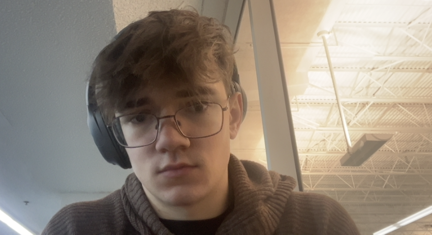
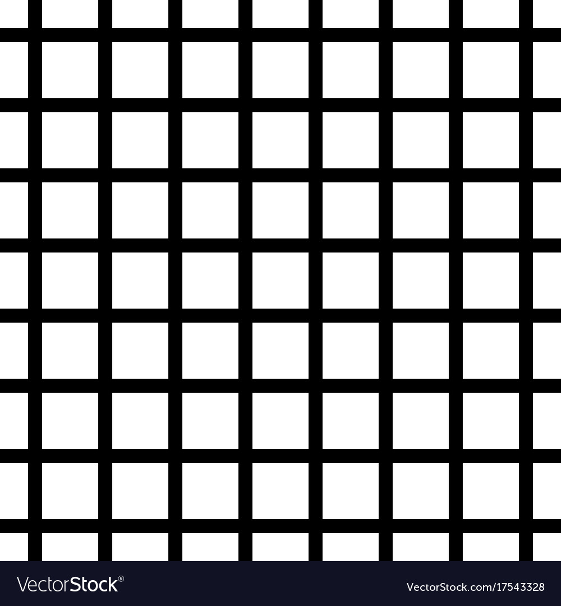
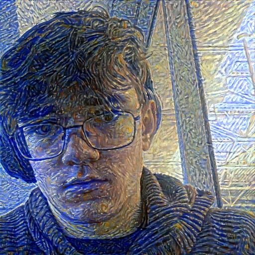

This project implements a minimalistic version of Neural Style Transfer (NST) using PyTorch

## Sample Outputs
Below are some sample outputs generated by this implementation. The left image is the content, the middle is the style, and the right is the generated image.

  
   

 

## Customization
You can adjust various parameters in the excecution to experiment with different aspects of style transfer, such as:
- Number of iterations
- Style weight
- Content weight
- Learning rate

## License
This project is licensed under the MIT License - see the LICENSE file for details.

## Acknowledgements
- Leon A. Gatys, Alexander S. Ecker, and Matthias Bethge for their pioneering work in Neural Style Transfer.
- The PyTorch team for providing an excellent deep learning framework.
